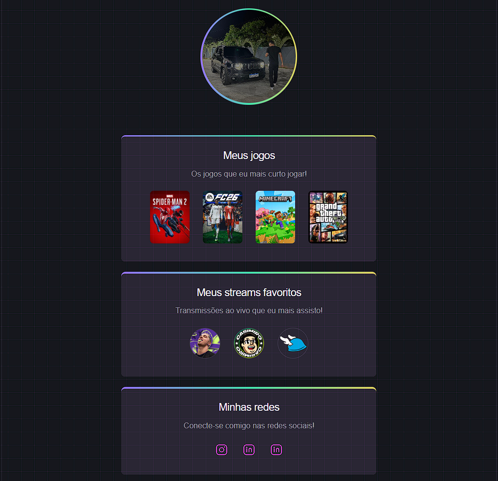

# 🎮 NLW eSports

<p align="center">
  
</p>

Aplicação em React focada na criação de **componentes reutilizáveis** e uso de **props**.

🔗 https://lucasods06.github.io/nlw-esports/

---

## 🛠️ Tecnologias

React • Vite • JavaScript • CSS

---

## 🧠 Aprendizados

* Componentização
* Props
* Renderização com `.map()`
* Desestruturação de props (`Section`)

---

## 📚 Referência

ReactJS em 1h - Componentes - Iniciantes — Mayk Brito

---

## ⚙️ Execução

```bash
npm install
npm run dev
npm run build
```
